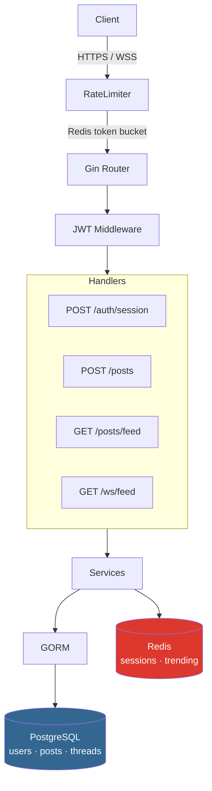

# `<echo> backend`


Anonymous microblogging API. No email. No phone. No PII stored.
Built with Go + Gin + PostgreSQL + Redis.

## Architecture



## Quick Start

```bash
git clone https://github.com/YOUR_USERNAME/echo-backend
cd echo-backend
cp .env.example .env
docker compose up -d
go run ./cmd/server
```

API: http://localhost:8080

## Migrations

Versioned SQL migrations are stored in [migrations](migrations).

```bash
docker compose run --rm migrate
```

On `docker compose up -d`, the `migrate` service also runs automatically once PostgreSQL is healthy.

## Endpoints

```
POST  /auth/session        create anonymous session → JWT + pseudonym
POST  /posts               create post  (≤280 chars, requires JWT)
GET   /posts/feed          trending feed  ?page=1&limit=20
POST  /posts/:id/reply     reply to post
POST  /posts/:id/react     body: {"type":"up"|"down"}
POST  /posts/:id/report    flag post for moderation
GET   /ws/feed             WebSocket — real-time new posts
```

## Project Structure

```
echo-backend/
├── cmd/server/         # main.go entrypoint
├── internal/
│   ├── handler/        # HTTP + WS handlers
│   ├── service/        # business logic
│   ├── repository/     # DB queries (GORM)
│   └── middleware/     # JWT, rate-limit
├── pkg/                # shared utils (pseudonym gen)
├── docker-compose.yml
└── .env.example
```

## Stack

| Layer    | Tech                     |
|----------|--------------------------|
| Language | Go 1.22                  |
| HTTP     | Gin                      |
| ORM      | GORM + PostgreSQL        |
| Cache    | Redis 7                  |
| Auth     | JWT (golang-jwt/jwt/v5)  |
| Realtime | WebSocket (gorilla/ws)   |
| CI/CD    | GitHub Actions           |
